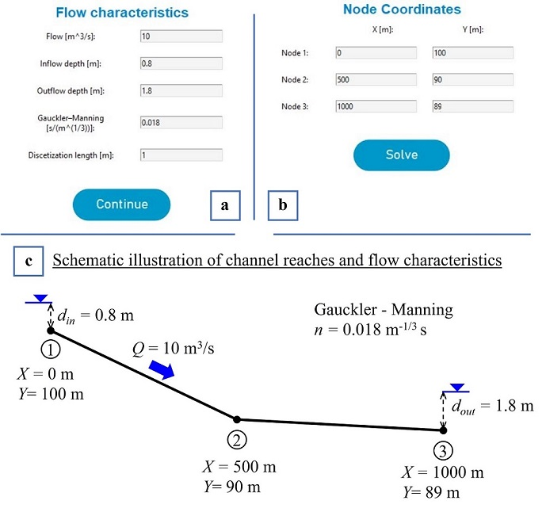
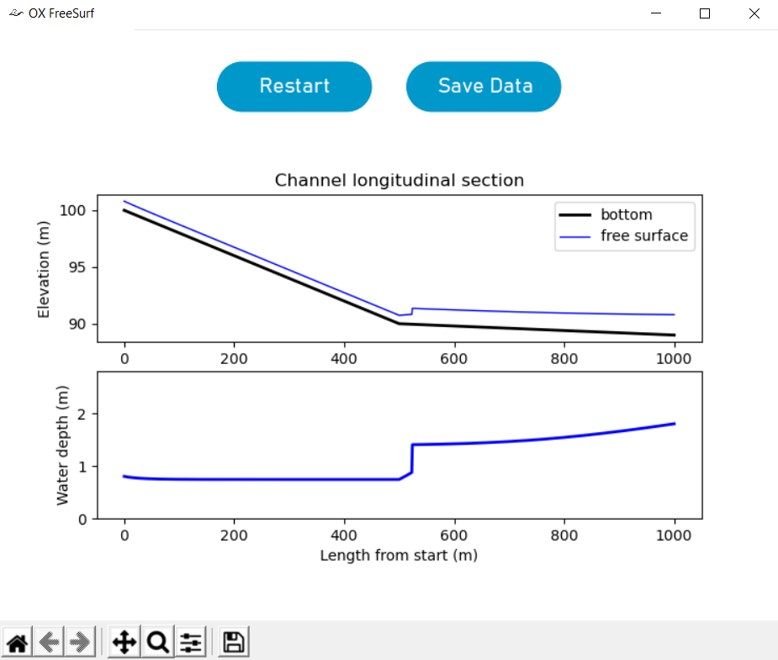
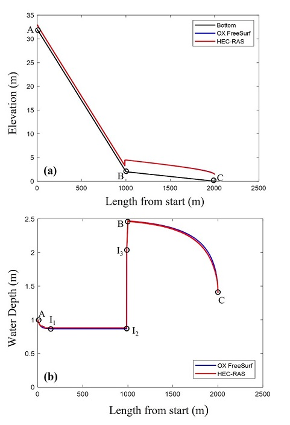
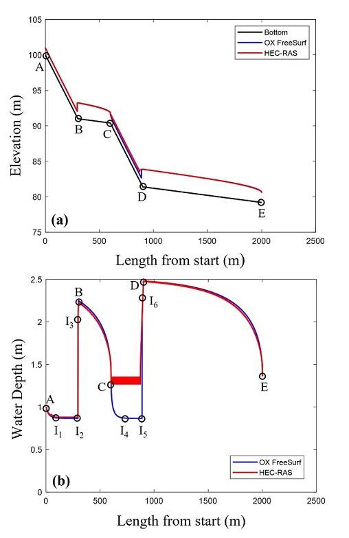

# Summary

`OX FreeSurf` is an open-source software that uses basic principles of open-channel hydraulics to 
effectively simulate one-dimensional, steady state, free-surface flows in open channels. 
The developed software is fully automated and it is characterized by simplicity in its use as 
well as parsimony in input entries, while exhibiting a friendly graphical user interface (GUI), 
allowing students, educators, engineering practitioners and researchers to conduct routine 
hydraulic calculations in the comfort of a user friendly interface and a widely used programming language. 
The software becomes available in two forms: a) as an open-source code written in Python programming language, 
allowing for case-specific modifications/interventions by advanced users, as well as possible extensions to 
address research questions, and b) as a single self-extracting installation file (i.e., `OX_FreeSurf_setup.exe`) 
for `Windows 8.1` or higher. In the latter case no additional actions are required by the user, as the software 
is installed automatically and can be run directly from the created icons. The functionality of `OX FreeSurf` 
was examined using two application examples of open-channel flow. The numerically calculated free-surface 
profiles were found in quantitative agreement with those obtained by applying the `HEC-RAS` model as well 
as one-dimensional analysis of the flow. Given its full automation and simplicity in use, `OX FreeSurf` 
is expected to serve as a useful tool/platform for educational/academic purposes, research, and engineering 
practice in general. 

# Statement of need

Computation of the steady state free-surface profile in open channel flow, requires numerical solution of the 
dynamic equation of gradually-varied-flow [@Chow:1959; @Mays:2010], to determine how the water 
depth varies along a given channel layout. For this purpose, the hydraulic engineer needs to: a) partition 
the channel into short reaches with constant bottom slope and given cross-sectional geometry, b) determine 
the normal and critical depths in each reach, c) use the given set of boundary conditions (i.e., the inflow 
and outflow depths), along with critical judgment driven by in depth knowledge of hydraulic principles, to 
determine the control sections of the flow, the corresponding flow profiles (i.e., drawdown and backwater 
curves), as well as the location of hydraulic jumps along the channel (i.e., a process usually referred to 
as qualitative flow profile analysis; see @Chow:1959 and @Langousis:2020), and d) 
integrate the dynamic equation of gradually-varied-flow between the identified control sections, properly 
taking into account abrupt depth changes caused by hydraulic jumps. Implementation of steps (a) - (d) 
constitutes a fundamental part of most existing operational software platforms, including [HEC-RAS](https://www.hec.usace.army.mil/software/hec-ras/)
(see @USACE:2016), [MIKE+](https://www.mikepoweredbydhi.com/) powered by DHI 
, [Channel Studio](https://www.hydrologystudio.com/) offered by Hydrology Studio , 
and [OpenFlows FlowMaster](https://www.bentley.com/en/products/product-line/hydraulics-and-hydrology-software) powered by Bentley . 
Important drawbacks of the foregoing platforms are that: a) with the exception of `HEC-RAS`, their use is not free of charge, 
b) they are not open-source, thus, not allowing for interventions/modifications by advanced users, and c) 
they are suited to address more complex problems than one-dimensional, steady state, free-surface flow 
integration in open channels, making problem setup by elementary users for educational purposes and 
routine design applications a rather complex task.

To address the needs of students, educators, engineering practitioners and researchers, while not 
competing with existing commercial tools, we developed `OX FreeSurf`, an open-source software written 
in Python programming language that uses basic principles of open channel hydraulics to effectively 
simulate one-dimensional, steady state, free-surface flows in prismatic open channels. To the best 
of our knowledge, there is no available open-source software for this purpose that is fully automated, 
characterized by simplicity in its use and parsimony in input entries, while exhibiting a friendly 
graphical user interface (GUI), making it suitable for educational/academic purposes and routine design 
applications. 

# Software Description – Example Usage

Before executing the open-source code of `OX FreeSurf`, the user should first download and install an 
open-source Python release (version 3.7 or higher), which runs smoothly (i.e., not encountering malfunctions/bugs; 
check maintenance status at python.org/downloads). After successful installation of Python, the user should also 
install: a) the $tkinter$ python package, b) the $pandas$ and $numpy$ libraries, c) the $matplotlib$ library, and d) the 
modules $sys$, $time$ and $os$.

### $Configuration$

Problem configuration is accomplished through the OX FreeSurf GUI windows (see \autoref{fig:fig1} and \autoref{fig:fig2}). 
First, the user should select the geometry of the hydraulic section of the open channel (i.e., rectangular or trapezoidal; 
Figure \autoref{fig:fig1}.a) and then set the bottom width, _b_, and the side slope _z_ (i.e., the wall width to height ratio; 
see \autoref{fig:fig1}.b and \autoref{fig:fig1}.c). It is noted that in the case of a rectangular section, the value of _z_
is set by default equal to zero. Next, the user is prompted to set the flowrate value _Q_ [m3/s], the upstream and downstream 
boundary conditions (i.e., the inflow depth _din_ [m] and the outflow depth _dout_ [m]), the Gauckler-Manning 
coefficient _n_ [m-1/3s], as well as the constant step to be used for the numerical integration of the free-surface 
profile _dx_ [m] (see \autoref{fig:fig2}.a and \autoref{fig:fig2}.c). As a final step, the user defines the number of nodes 
of the polyline that best describes the altimetry of the channel’s reaches (no limitation exists for the maximum number of nodes), 
and specifies their coordinates; i.e., _X_: horizontal, and _Y_: vertical (see \autoref{fig:fig2}.b and \autoref{fig:fig2}.c). 
After successful execution, a new window appears that includes a plot of the channel’s longitudinal section, together with 
the corresponding elevations of the free surface, where the user can zoom in and out to focus on specific locations of interest 
(see \autoref{fig:fig3}). The user can also choose to export the plot in .jpg (picture) and/or .xlsx (table) formats and, 
optionally, start a new simulation.

### $Example~{Usage}$

In this Section, we demonstrate the functionality of `OX FreeSurf` using two application examples. More precisely, we compare 
the free-surface profiles calculated by `OX FreeSurf` with those obtained using `HEC-RAS`: a widely used software for free-surface 
flow calculations in open channels [@Mays:2010; @Lee:2006; @Rao:2016; @Gkikas:2019]. Both examples 
regard calculation of the free-surface profile in a rectangular open channel with bottom width _b_ = 2 m, flowrate _Q_ = 10 m3/s, 
Gauckler-Manning coefficient _n_ = 0.018 m-1/3s, and boundary conditions: _din_ = 1 m (inflow depth), 
and _dout_ = 1.4 m (outflow depth). The discretization step used, in both cases, for the numerical integration 
of the free-surface profile is _dx_ = 1 m. 

In Example 1, the channel is composed by two distinct reaches: reach AB has supercritical slope _JAB_ = 3% and is 
followed by reach BC with subcritical slope _JBC_ = 2‰ (see black line in \autoref{fig:fig4}.a, and Table 1 for the 
coordinates of points A, B and C of the channel’s longitudinal section). Example 2 concerns a more complex open channel, which 
exhibits three changes of bottom slope, and is composed by four distinct reaches: reach AB with supercritical slope 
_JAB_ = 3%, reach BC with subcritical slope _JBC_ = 2‰, reach CD with supercritical slope _JCD_ = 3%, 
and reach DE with subcritical slope _JDE_ = 2‰ (see black line in \autoref{fig:fig5}.a, and Table 1 for the coordinates of points A, B, 
C, D and E of the channel’s longitudinal section).

**Table 1**: Coordinates of the points/nodes that define the longitudinal sections of the two channels in Examples 1 and 2; see main text for details
|            | Node A   | Node B   | Node C    | Node D    | Node E     |
|---         |---:      |---:      |---:       |---:       |---:        |
| **Example 1**  |(0, 32)   |(1000, 2) |(2000, 0)  |-          |-           |
| **Example 2**  |(0,100)   |(300,91)  |(600, 90.4)|(900, 81.4)|(2000, 79.2)|

For the case of Example 1, \autoref{fig:fig4}.a and \autoref{fig:fig4}.b show the water surface elevation and the water depth, 
respectively, along the channel as calculated by `OX FreeSurf` (blue line) and `HEC-RAS` (red line). The flow starts at section 
A with depth _din_ = 1 m and proceeds to section I1 where the depth of the flow becomes equal to the normal 
depth: _dn_ = 0.867 m (as calculated by `OX FreeSurf` and checked using the [Victor's M. Ponce](http://uon.sdsu.edu/online_calc.php) 
online platform for one-dimensional hydraulic calculations). The free-surface profile between sections A and I1 follows a 
S2 drawdown curve, as the normal depth lies below the inflow depth. Between sections I1 and I2 the 
flow remains uniform with normal depth _dn_ = 0.867 m, and at section I2 a hydraulic jump occurs as the flow 
abruptly transitions from a supercritical state (at section I2 with flow depth _d_I2 = _dn_ = 0.867 m) 
to a subcritical state; i.e., at section I3 with flow depth _d_I3 = 2.05 m. The latter depth value has been obtained 
from `OX FreeSurf` and, as expected, it equals the conjugate subcritical depth of _d_I2 = 0.867 m (cross checked using the 
[Victor's M. Ponce](http://uon.sdsu.edu/online_calc.php) online platform. Between sections I3 and B the flow is subcritical 
with free-surface profile that follows a S1 backwater curve with ending depth _d_B = 2.47 m at section B. The 
flow in reach BC remains subcritical with the free-surface profile following a M2 backwater curve till the outflow depth 
_dout_ = 1.4 m at Section C. In general, apart from a slight overestimation of the normal depth in reach I1I2 
by `HEC-RAS` (i.e., _dn_ = 0.88 m) relative to `OX FreeSurf` and that resulting from one-dimensional analysis 
(i.e., _dn_ = 0.867 m), both `OX FreeSurf` and `HEC-RAS` provide accurate water depth estimates.

Similar to \autoref{fig:fig4}.a and \autoref{fig:fig4}.b for Example 1, \autoref{fig:fig5}.a and \autoref{fig:fig5}.b show the 
water surface elevation and the water depth, respectively, for the case of Example 2. Within reaches AB and BC the flow profile 
matches that calculated in Example 1, with the only difference that the ending depth of the M2 profile at Section 
C, _dc_, is equal to the critical depth _dcritical_ = 1.366 m (as calculated by `OX FreeSurf` and cross 
checked using the [Victor's M. Ponce](http://uon.sdsu.edu/online_calc.php) online platform. This is due to the slope change of 
the channel at section C from subcritical (i.e., within reach BC, _JBC_ = 2‰) to supercritical (i.e., within reach 
CD, _JCD_ = 3%), resulting in a hydraulic drop. As correctly computed by `OX FreeSurf` (blue line), between sections 
C and I4 the free surface profile follows the S2 drawdown curve until the normal depth is reached at section 
I4 (_d_I4 = _dn_ = 0.867 m), and then the flow remains uniform till section I5, where 
a hydraulic jump occurs, resulting in subcritical depth _d_I6 = 2.05m at section I6 (see also Example 1). 
However, the same does not hold for the free-surface profile calculated by `HEC-RAS`, as the water depth cannot capture the 
hydraulic drop at section C, with the computed water depths between sections C and I5 fluctuating around the critical 
depth _dcritical_ = 1.366 m (see @USACE:2016 on possible numerical instabilities in `HEC-RAS` calculated free 
surface profiles). Between sections I6 and D the flow is subcritical with free-surface profile that follows a 
S1 backwater curve with ending depth _d_D = 2.48m at section D. The flow in reach DE remains subcritical 
with the free-surface profile following a M2 backwater curve till the outflow depth _dout_ = 1.4 m at Section E.

# Acknowledgements

This work has been supported by the Region of Western Greece as part of the research project “Investigation 
of the hydraulic behavior and suggestions for the regulation of the hydrodynamic system of Trichonida - Lysimachia 
lakes, in Western Greece”. 

# References