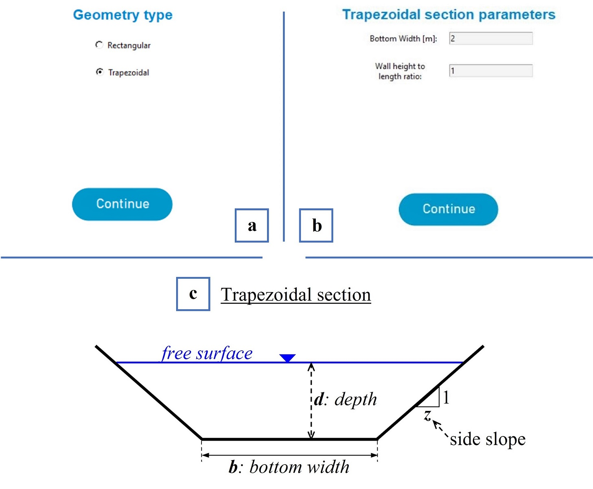
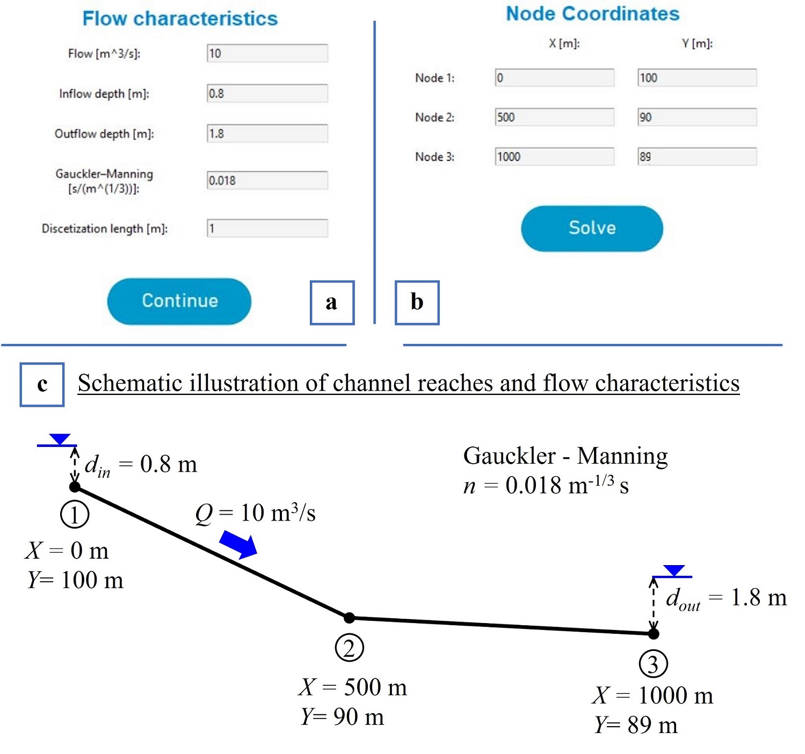
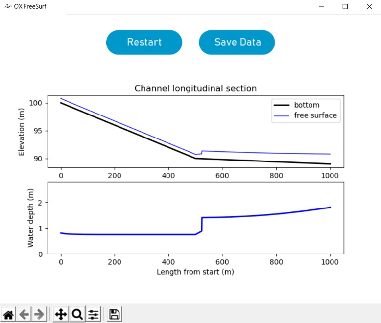

# Summary
`OX FreeSurf` is an open-source software that uses basic principles of open-channel hydraulics to 
effectively simulate one-dimensional, steady state, free-surface flows in open channels. 
The developed software is fully automated and it is characterized by simplicity in its use as 
well as parsimony in input entries, while exhibiting a friendly graphical user interface (GUI), 
allowing students, educators, engineering practitioners and researchers to conduct routine 
hydraulic calculations in the comfort of a user friendly interface and a widely used programming language. 
The software becomes available in two forms: a) as an open-source code written in Python programming language, 
allowing for case-specific modifications/interventions by advanced users, as well as possible extensions to 
address research questions, and b) as a single self-extracting installation file (i.e., `OX_FreeSurf_setup.exe`) 
for `Windows 8.1` or higher. In the latter case no additional actions are required by the user, as the software 
is installed automatically and can be run directly from the created icons. The functionality of `OX FreeSurf` 
was examined using two application examples of open-channel flow. The numerically calculated free-surface 
profiles were found in quantitative agreement with those obtained by applying the `HEC-RAS` model as well 
as one-dimensional analysis of the flow. Given its full automation and simplicity in use, `OX FreeSurf` 
is expected to serve as a useful tool/platform for educational/academic purposes, research, and engineering 
practice in general. 

# Statement of need
Computation of the steady state free-surface profile in open channel flow, requires numerical solution of the 
dynamic equation of gradually-varied-flow [@Chow:1959; @Mays:2010], to determine how the water 
depth varies along a given channel layout. For this purpose, the hydraulic engineer needs to: a) partition 
the channel into short reaches with constant bottom slope and given cross-sectional geometry, b) determine 
the normal and critical depths in each reach, c) use the given set of boundary conditions (i.e., the inflow 
and outflow depths), along with critical judgment driven by in depth knowledge of hydraulic principles, to 
determine the control sections of the flow, the corresponding flow profiles (i.e., drawdown and backwater 
curves), as well as the location of hydraulic jumps along the channel (i.e., a process usually referred to 
as qualitative flow profile analysis; see @Chow:1959 and @Langousis:2020), and d) 
integrate the dynamic equation of gradually-varied-flow between the identified control sections, properly 
taking into account abrupt depth changes caused by hydraulic jumps. Implementation of steps (a) - (d) 
constitutes a fundamental part of most existing operational software platforms, including [HEC-RAS](https://www.hec.usace.army.mil/software/hec-ras/)
(see @USACE:2016), [MIKE+](https://www.mikepoweredbydhi.com/) powered by DHI 
, [Channel Studio](https://www.hydrologystudio.com/) offered by Hydrology Studio , 
and [OpenFlows FlowMaster](https://www.bentley.com/en/products/product-line/hydraulics-and-hydrology-software) powered by Bentley. 
Important drawbacks of the foregoing platforms are that: a) with the exception of `HEC-RAS`, their use is not free of charge, 
b) they are not open-source, thus, not allowing for interventions/modifications by advanced users, and c) 
they are suited to address more complex problems than one-dimensional, steady state, free-surface flow 
integration in open channels, making problem setup by elementary users for educational purposes and 
routine design applications a rather complex task.

To address the needs of students, educators, engineering practitioners and researchers, while not 
competing with existing commercial tools, we developed `OX FreeSurf`, an open-source software written 
in Python programming language that uses basic principles of open channel hydraulics to effectively 
simulate one-dimensional, steady state, free-surface flows in prismatic open channels. To the best 
of our knowledge, there is no available open-source software for this purpose that is fully automated, 
characterized by simplicity in its use and parsimony in input entries, while exhibiting a friendly 
graphical user interface (GUI), making it suitable for educational/academic purposes and routine design 
applications. 

# Software Description
Before executing the open-source code of `OX FreeSurf`, the user should first download and install an 
open-source Python release (version 3.7 or higher), which runs smoothly (i.e., not encountering malfunctions/bugs; 
check maintenance status at python.org/downloads). After successful installation of Python, the user should also 
install: a) the $tkinter$ python package, b) the $pandas$ and $numpy$ libraries, c) the $matplotlib$ library, and d) the 
modules $sys$, $time$ and $os$.

### $Configuration$
Problem configuration is accomplished through the OX FreeSurf GUI windows (see \autoref{fig:fig1} and \autoref{fig:fig2}). 
First, the user should select the geometry of the hydraulic section of the open channel (i.e., rectangular or trapezoidal;
 \autoref{fig:fig1}.a) and then set the bottom width, _b_, and the side slope _z_ (i.e., the wall width to height ratio; 
see \autoref{fig:fig1}.b and \autoref{fig:fig1}.c). It is noted that in the case of a rectangular section, the value of _z_
is set by default equal to zero. Next, the user is prompted to set the flowrate value _Q_ [m^3^/s], the upstream and downstream 
boundary conditions (i.e., the inflow depth _d~in~_ [m] and the outflow depth _d~out~_ [m]), the Gauckler-Manning 
coefficient _n_ [m^-1/3^s], as well as the constant step to be used for the numerical integration of the free-surface 
profile _dx_ [m] (see \autoref{fig:fig2}.a and \autoref{fig:fig2}.c). As a final step, the user defines the number of nodes 
of the polyline that best describes the altimetry of the channel’s reaches (no limitation exists for the maximum number of nodes), 
and specifies their coordinates; i.e., _X_: horizontal, and _Y_: vertical (see \autoref{fig:fig2}.b and \autoref{fig:fig2}.c). 
After successful execution, a new window appears that includes a plot of the channel’s longitudinal section, together with 
the corresponding elevations of the free surface, where the user can zoom in and out to focus on specific locations of interest 
(see \autoref{fig:fig3}). The user can also choose to export the plot in .jpg (picture) and/or .xlsx (table) formats and, 
optionally, start a new simulation.

# Acknowledgements

This work has been supported by the Region of Western Greece as part of the research project “Investigation 
of the hydraulic behavior and suggestions for the regulation of the hydrodynamic system of Trichonida - Lysimachia 
lakes, in Western Greece”. 

# References